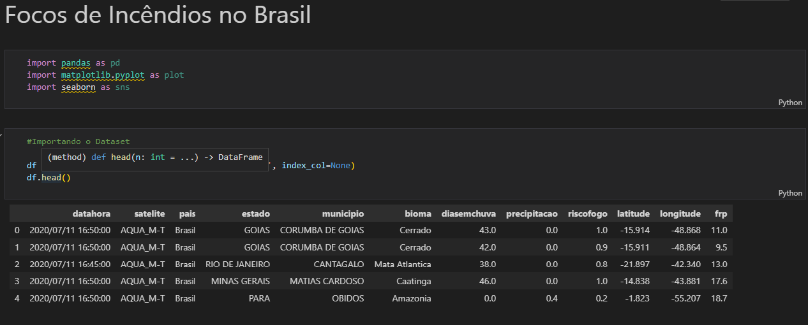
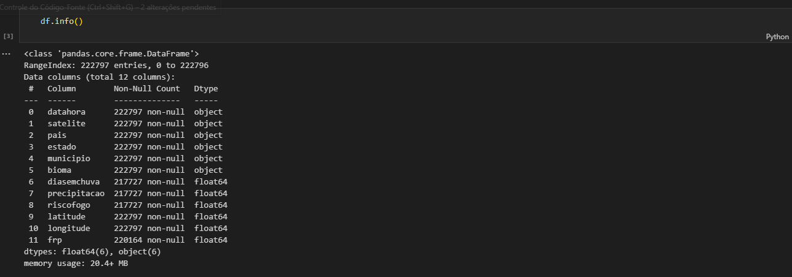

# Ciencias_de_Dados
https://github.com/carmoemanoel/Ciencias_de_Dados/blob/master/LICENSE
# Sobre o projeto
Esse projeto de Ciência de  Dados  foi desenvolvido em cojunto com alguns alunos da Faculdade.
Temos como objetivo explorar alguns dados relacionados a temas atuais e assim  termos uma visão mais geral sobre os Dataset.

# Mapas/Imagens
As imagens abaixo ilustra como importamos e tratamos os dados dos Dataset.

# Manipulação e limpeza dos dados com Pandas

